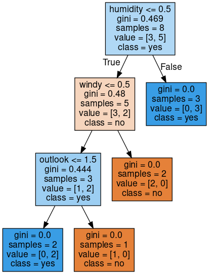

## Decision Tree Classifier for Tennis Play Prediction

This project aims to predict whether tennis can be played based on weather conditions. It utilizes a Decision Tree Classifier algorithm to build a predictive model using a given dataset.

### Installation
- Make sure you have Python installed on your system.
- Install the required dependencies by running the following command:
```python
pip install pandas numpy graphviz scikit-learn
```

### Usage
- Ensure that the `PlayTennis.csv` dataset file is in the same directory as the code.
- Run the code in your preferred Python environment.
- The program will output the accuracy of the Decision Tree model on the test dataset and display a visualization of the decision tree.

### Dataset
The dataset used in this project, `PlayTennis.csv`, contains weather attributes such as outlook, temperature, humidity, and wind, along with a target variable indicating whether tennis can be played (yes or no). The dataset was sourced from [example.com] and preprocessed before training the model.

### Methodology
1. Importing the necessary modules: pandas, numpy, graphviz, and scikit-learn.
2. Loading the dataset into a pandas DataFrame.
3. Preprocessing the data by converting the categorical target variable to numeric using LabelEncoder.
4. Splitting the data into training and testing sets using the train_test_split function.
5. Training a DecisionTreeClassifier on the training data.
6. Predicting the outcome for the test dataset.
7. Evaluating the accuracy of the model using the accuracy_score metric.
8. Visualizing the decision tree using graphviz and exporting it to a graphical representation.

### Results and Discussion
The model achieved an accuracy of 66.6%, indicating its ability to predict tennis play based on weather conditions. The decision tree visualization provides insights into the decision-making process of the classifier, showcasing the important features and splitting criteria.



### Reproducibility
To reproduce the results obtained in this project, follow these steps:
1. Install the required dependencies as mentioned in the Dependencies section.
2. Ensure that the `PlayTennis.csv` dataset file is in the same directory as the code.
3. Run the code in your preferred Python environment, making sure to set the random seed to 42 for reproducibility.
4. The program will output the accuracy and display the decision tree visualization.

## License
This project is licensed under the [MIT License](LICENSE).
